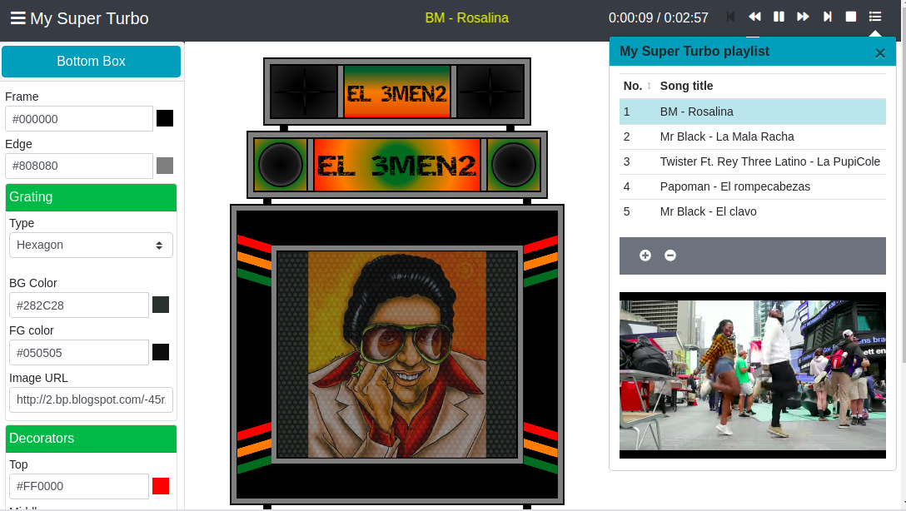

# TurboApp

**¿Querías un Turbo?...** DJ Teofibot te regala uno, además te deja reproducir yeré mientras lo customizas a tu gusto.

Con **TurboApp** ya no necesitarás invertir un solo centavo de tu bolsillo para sentirte el amo y señor propietario de los reconocidos y majestuosos escaparates sonoros del momento.

<p align="center">
	
</p>

**TurboApp** es una aplicación web desarrollada para mitigar cualquier carencia de turbos que un ser humano pueda presentar. 

### Features
Las principales funcionalidades de esta aplicación son:

  - Customizar la apariencia del turbo.
  	- Asignar el nombre del turbo.
  	- Ajustar los colores de cada uno de los elementos decorativos del turbo.
  	- Asignar una imagen a la rejilla de la caja principal.
  	- Definir colores en los gradientes aplicados a parlantes y rejillas.
  - Reproducir de videos videos de una _playlist_.    
  - Gestionar la _playlist_ de yeré.    
  	- Agregar videos de YouTube a la _playlist_.
  	- Remover elementos de la _playlist_.


## Ponlo a sonar y a llenar la pista.

Para hacer uso de esta aplicación solo debes seguir los siguientes dos pasos.

* Descargar y descomprimir el archivo comprimido de [aquí](https://github.com/jtuburon/turboapp/raw/master/resources/turboapp.zip)
* Desde el directorio descomprimdo, abrir el fichero **index.html** con un simple doble click.

## Sección para desarrolladores de software

### Tecnologias

**TurboApp** hace uso de varias herramientas open-source dentro de las cuales se destacan:

* [NodeJS](https://nodejs.org/).
* [Vue.js](https://vuejs.org/)
* [Boostrap + Vue](https://bootstrap-vue.js.org/)

### Instalación
```
npm install
```

### Compilación para ambiente de desarrollo con auto-reload
```
npm run serve
```

### Compilación para ambiente de producción
```
npm run build
```

### To DO

Esta aplicación ha sido desarrollada durante parte de mi tiempo libre. Aún faltan algunas funcionalidades deseadas por implementar como son:

- Implementar controles para modificar las dimensiones de los gradientes de colores para cada componente.
- Implementar un mecanismo de validación para realizar el filtrado de videos de YouTube que no puedan ser embebidos en otras aplicaciones debido a temas de reclamación de derechos de autor.
